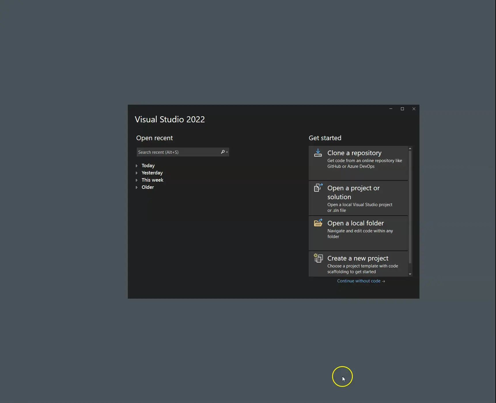
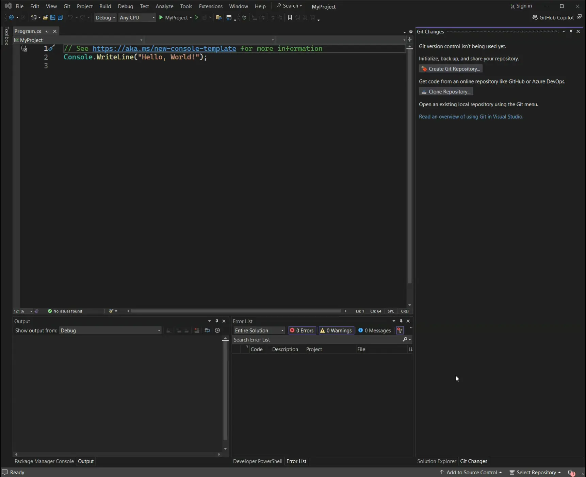

# Getting started using Visual Studio

Follow these steps to create your first custom indicator for Tickblaze using Visual Studio.

> Prerequisites
> - [Visual Studio](https://visualstudio.microsoft.com/)
> - Install [.NET SDK](https://dotnet.microsoft.com/en-us/download/dotnet/8.0) 8.0

### 1. Create a New Solution and Project



1. **Open Visual Studio**.
2. **Start a New Project**:
   - From the **Start Window**, click on **Create a new project**.
   - Choose a **Class Library** C# project template and click **Next**.
3. **Configure the Project**:
   - Give your project a **name**.
   - Choose a **location** for your project.
   - Set the **Solution name** as desired.
   - Click **Next**.
   - Select the **.NET 8.0** framework
   - Click **Create**.

### 2. Add a NuGet Package



1. **Open the NuGet Package Manager**:
   - Right-click on the **project** in the **Solution Explorer**.
   - Select **Manage NuGet Packages...**.
2. **Browse and Install Packages**:
   - Go to the **Browse** tab in the NuGet Package Manager.
   - Search for a package **Tickblaze.Scripts.Api**.
   - Select the package and click **Install**.
3. **Accept License Agreements** if prompted.

### 3. Create Your Indicator


1. **Create a New Class**:
   - In **Solution Explorer**, right-click on the **project**.
   - Select **Add > Class...**.
2. **Name the Class**:
   - Enter a **name** for your class (e.g., `TypicalPrice.cs`) and click **Add**.
3. **Define the Class**:
   - Open the new `.cs` file and replace its contents with:
   ```cs
    namespace CustomIndicator;

    /// <summary>
    /// A custom indicator that calculates the typical price for a bar.
    /// </summary>
    public partial class TypicalPrice : Indicator
    {
        [Plot("Result")]
        public PlotSeries Result { get; set; } = new(Color.Blue, LineStyle.Solid, 1);

        public TypicalPrice()
        {
            Name = "Typical Price";
            IsOverlay = true;
        }

        /// <summary>
        /// Calculates the typical price for the given bar.
        /// </summary>
        protected override void Calculate(int index)
        {
            var bar = Bars[index];

            Result[index] = (bar.High + bar.Low + bar.Close) / 3;
        }
    }
    ```

### 4. Build the Solution

1. **Build the Project**:
   - Go to the **Build** menu and select **Build Solution** (or press `Ctrl+Shift+B`).
2. **Check for Errors**:
   - Any errors will be displayed in the **Error List** at the bottom.
   - If there are errors, fix them and then rebuild the solution.

### 5. Run the Indicator in Tickblaze

After building your project, the indicator should be automatically imported into Tickblaze. To run it:

1. **Right-click** on the chart in Tickblaze.
2. Select `Indicators` and click `Add / Edit Settings`.
3. From the dropdown menu, select `Typical Price`.
4. Click the down arrow to add it to the chart.
5. Click the `OK` button.

### 6. Debug the Indicator


1. **Start Tickblaze** as usual if not running yet.
2. **Attach to `Tickblaze.View.exe` process**:
   - Go to the **Debug** menu in Visual Studio and select **Attach to Process...**.
   - In the **Attach to Process** window, locate and select `Tickblaze.View.exe` from the list of available processes.
   - You can filter the processes by name or use the search box to find `Tickblaze.View.exe` quickly.   
3. **Choose the Correct Debugger**:
   - In the **Attach to** section, ensure that the correct type of code is selected (for example, **.NET** for managed code).   
4. **Attach**:
   - Once selected, click **Attach**.   
5. **Set Breakpoints**:
   - Set breakpoints in your code by clicking on the left margin next to the line of code where you want the debugger to pause.   
6. **Debug the Indicator**:
   - Once attached, the debugger will stop at breakpoints in your code, allowing you to inspect variables, step through your code, and analyze the indicator's behavior.   
7. **Stop Debugging**:
   - When finished, you can stop debugging by going to the **Debug** menu and selecting **Stop Debugging** or pressing `Shift+F5`.
